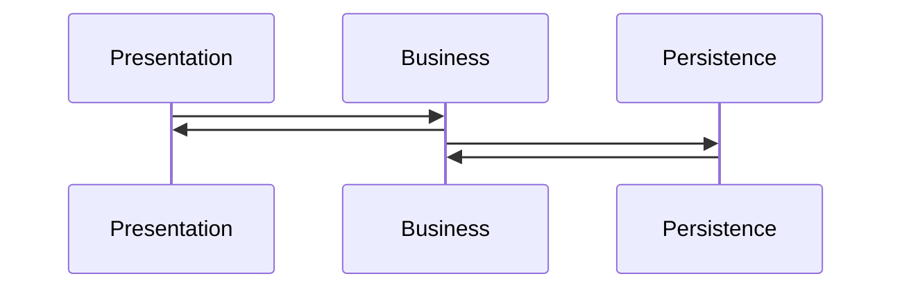
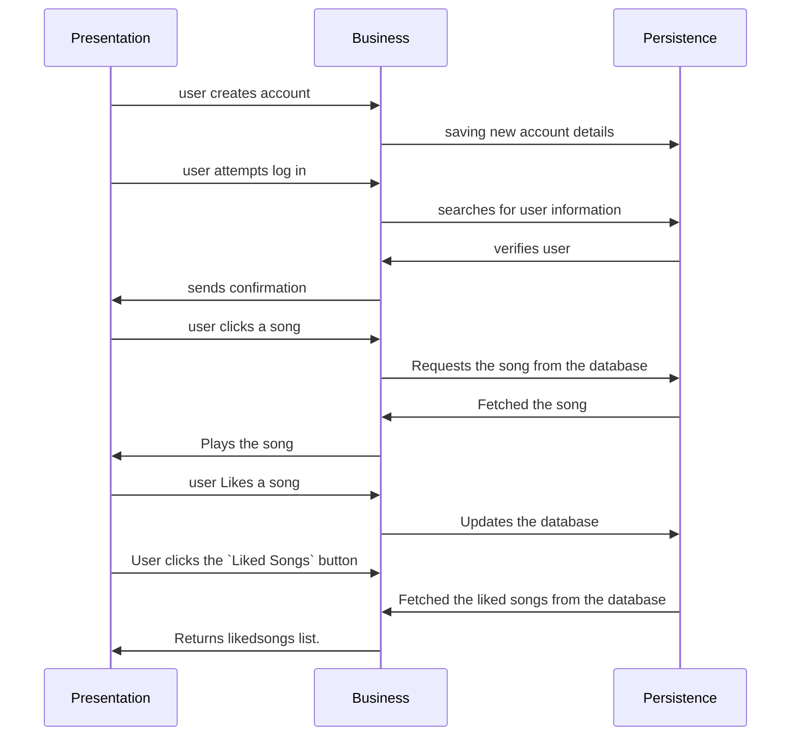

# COMP3350 G09 Iteration 3
## MusicLoud Architecture

### Packages
* Application (com.example.musicloud.application)
* Business (com.example.musicloud.business)
* Objects (com.example.musicloud.objects)
* Persistence
    * HSQLDB (com.example.musicloud.persistence.hsqldb)
    * Stubs (com.example.musicloud.persistence.stubs)
* Presentation (com.example.musicloud.presentation)
* Tests
    * Android test
        * Presentation
    * Test
        * Business
        * Objects
        * Persistence

### Layers
| Presentation/UI | Logic/Business | Persistence/Data     |
|-----------------|----------------|----------------------|
| Login           | LoginManager   | UserManagementHSQLDB |
| Regsiter        | AccessUsers    | UserManagementHSQLDB |
| PlayActivity    | AccessSongs    | SongPersistenceHSQLDB|
| MediaPlayerUtil | AccessSongs    | SongPersistenceHSQLDB|
| LikedActivity   | AccessSongs    | SongPersistenceHSQLDB|
| Messages        |                |                      |
| PlayActivity    | AccessSongs    | SongPersistenceHSQLDB|

### Overview
### Three tiered architecture:

We have untilized a multi-tiered system to develop our application. This includes three main tiers: `Persistance`, `Business`, and `Presentation`. The communication between these packages is strict in order to maintian the stucture of our code. 

## Diagram

### Presentation
- Presentation builds the log-in interface using `LoginActivity`. 
- For new users, the `RegisterActivity` is run in order to create new login credentials. 
- `PlayActivity` is responsible for facilitating the interface to play each song. 
- `MediaPlayerUtil` is resposible for managing the songs and keeping them in order. 
- `LikedActivity` is responsible for the new UI of Liked songs.
- `PlayActivity` is responsible for the Music Play/Pause UI.
- `RunPlaylistActivity` and `AddPlaylistActivity` are responsible for providing the playlist UI.

### Domain Model Objecs

- `Playlist` represents a collection of songs that a user has created and organized into a list.
- `Song` represents an individual audio track or recording. The Song object is a fundamental domain object within a music management system, as it is the basic unit of music that is stored, organized, and played within the system.
- `SP` represents a many-to-many relationship between the "Song" and "Playlist" domain model objects. The SongPlaylist object acts as a join or association object that connects individual songs to playlists, allowing songs to be included in multiple playlists and playlists to contain multiple songs.
- `User` represents an individual who has registered an account within the system. The User object is a fundamental domain object within a music management system, as it provides the means to authenticate and personalize the user experience within the system.

### Business
- At the moment business handles user accounts and access within the `AccessUsers` class.
- `Access Songs` is responsible for accessing the songs form the database.
- `Access Playlist` is responsible for accessing the playlist from the database.
- `Access SP` is responsible for accessing the join of song and playlist from the database.
- `LoginManager` is responsible for verifying the users i.e. matching the credentials form the database.
- `ValidationInput` makes sure that Users enter valid information while creating an account.
- `AccountAlreadyExistsException` is a custom exception class created to handle the duplicate user accounts.
- `EmptyUserIDException` is a custom exception class created to handle an instance when the user does not provide an ID while registering for the app.
- `PasswordTooShortException` is a custom exception class created to handle an instance when the password entered by the user is too short.

### Persistance

- Included in the persistance layer are the **interfaces**:
    - UserManagement
    - PlaylistPersistence
    - SongPersistence
    - and SPPersistence.
- And their **implementation**:
    - UserManagementHSQLDB
    - PlaylistPersistenceHSQLDB
    - SongPersistenceHSQLDB
    - SPPersistenceHSQLDB
    

## Branching Strategy
We've been using Modified GitHub Flow branching strategy because it allows us to work on seperate features and user stories in seperate branches. At the end of the iteration, we merge respective branches into the main branch which is then ready for release.

## What is currently complete and working?
1. Implementation and connection to the HSQLDB (Without calling the database/create statements in the HSQLDB file/persistence layer)
2. Three new features: 
    - Day/Night View
    - Playlist
    - Search
3. Searching for a song.
4. Adding a song to the playlist, removing playlists.
5. Playing from a playlist.
6. Switching between Day and Night modes.
7. We worked on the code smells and bugs with the highest priority.

## Any special instructions on using the app?
- If there is an error connecting to the database, try wiping the data from the emulator using the device manager and run the application again.

## What did we move to the next Iteration?
- After calculating the project velocity and completing the retrospective activity we decided to move the following features to the "Future" iteration. 
    - Recommendation System
    - Listening History
    - Report 
    - Filter

