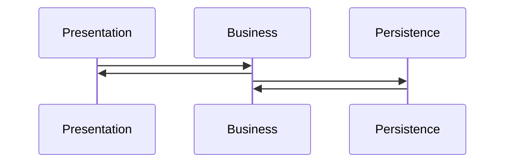
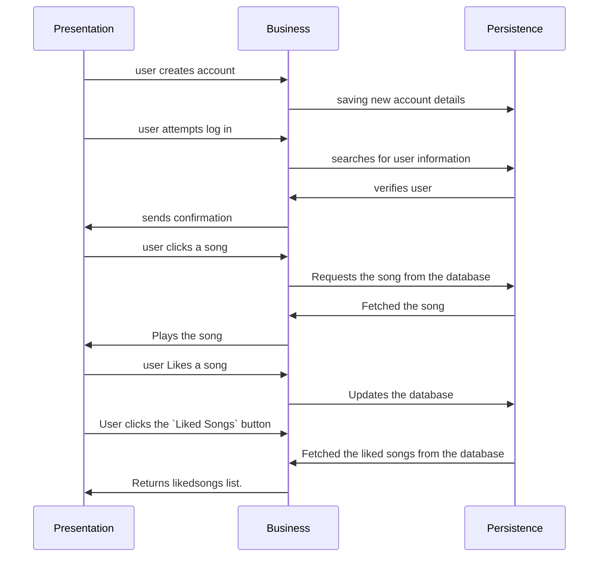

# COMP3350 G09 Iteration 2
## MusicLoud Architecture

### Packages
* Application (com.example.musicloud.application)
* Business (com.example.musicloud.business)
* Objects (com.example.musicloud.objects)
* Persistence
    * HSQLDB (com.example.musicloud.persistence.hsqldb)
    * Stubs (com.example.musicloud.persistence.stubs)
* Presentation (com.example.musicloud.presentation)
* Tests
    * Business
    * Objects
    * Persistence

### Layers
| Presentation/UI | Logic/Business | Persistence/Data     |
|-----------------|----------------|----------------------|
| Login           | LoginManager   | UserManagementHSQLDB |
| Regsiter        | AccessUsers    | UserManagementHSQLDB |
| PlayActivity    | AccessSongs    | SongPersistenceHSQLDB|
| MediaPlayerUtil | AccessSongs    | SongPersistenceHSQLDB|
| LikedActivity   | AccessSongs    | SongPersistenceHSQLDB|
| Messages        |                |                      |
| PlayActivity    | AccessSongs    | SongPersistenceHSQLDB|

### Overview
### Three tiered architecture:

We have untilized a multi-tiered system to develop our application. This includes three main tiers: `Persistance`, `Business`, and `Presentation`. The communication between these packages is strict in order to maintian the stucture of our code. 

## Diagram

### Presentation
- Presentation builds the log-in interface using `LoginActivity`. 
- For new users, the `RegisterActivity` is run in order to create new login credentials. 
- `PlayActivity` is responsible for facilitating the interface to play each song. 
- `MediaPlayerUtil` is resposible for managing the songs and keeping them in order. 
- `LikedActivity` is responsible for the new UI of Liked songs.
- `PlayActivity` is responsible for the Music Play/Pause UI.

### Business
- At the moment business handles user accounts and access within the `AccessUsers` class.
- `Access Songs` is responsible for accessing the songs form the database.
- `LoginManager` is responsible for verifying the users i.e. matching the credentials form the database.
- `ValidationInput` makes sure that Users enter valid information while creating an account.

### Persistance
Included in the persistance layer is UserManagement, UserManagementStub, SongPersistence, SongPersistenceStub and UserManagementHSQLDB.
- `UserManagement` is the interface that is implemented by `UserManagementStubs` and `UserManagementHSQLDB`.
- `SongPersistence` is the interface that is implemented by `SongPersistenceStubs` and `SongPersistenceHSQLDB`.

## Branching Strategy
We've been using Modified GitHub Flow branching strategy because it allows us to work on seperate features and user stories in seperate branches. At the end of the iteration, we merge respective branches into the main branch which is then ready for release.

## What is currently complete and working?
1. Implementation and connection to the HSQLDB
2. A new feature: Liked songs
3. Liking a song and viewing the liked song in a new page.
4. We worked on the code smells and bugs with the highest priority.

## Any special instructions on using the app?
- Register using the register button before logging into the app. 
- You can use the username = "admin", password = "admin" if you don't want to register. 

## What did we move to the next Iteration?
- On the Dev branch, we implemented the playlist feature.
- The whole logic layer is almost implemented, we just couldn't figure out how to connect it to the database so we decided to push it to the next iteration.

## APK
- The APK is too large to attach to GitLabs.
- Here's the sharable link for the APK : https://drive.google.com/file/d/1S1yxcCjBmBCqdILQpHculU7wcKPMQ_pw/view?usp=sharing

